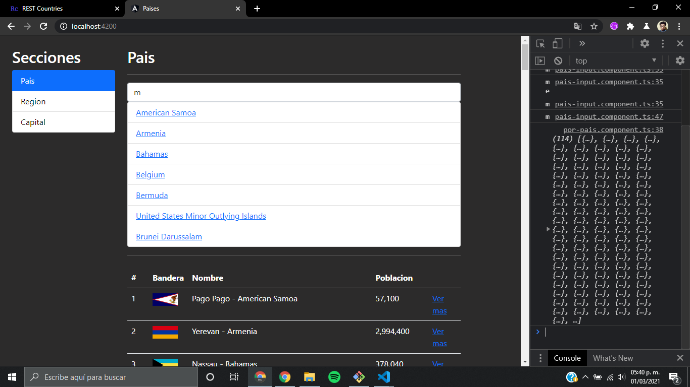
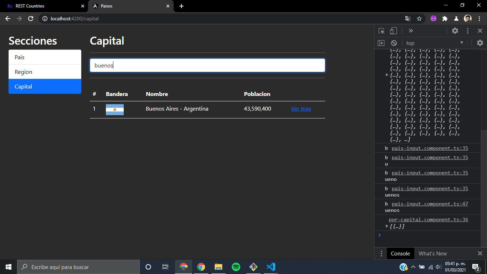
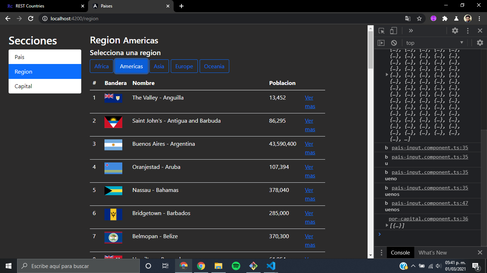
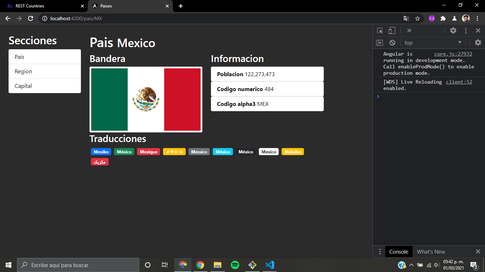

# Paises API

Aplicación desarrollada en **Angular** en donde su enfoque es consumir una **API** mediante peticiones http utilizando componentes y modulos de angular como: **HttpClient, HttpParams, RXJS, RouterModule** entre otras mas...

#### Capturas

